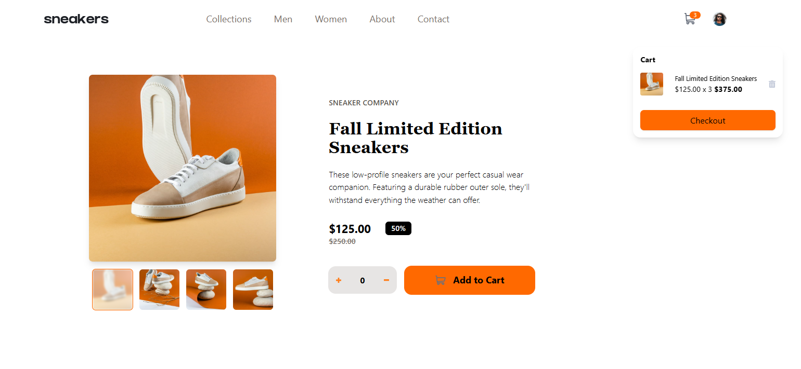
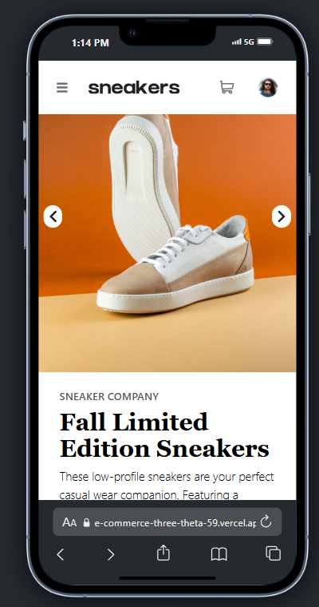
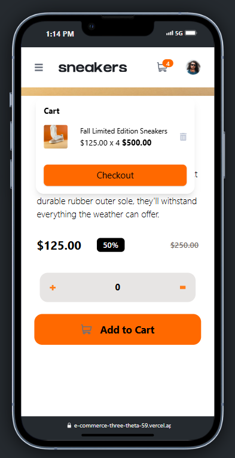

# 🛍️E-Commerce Website
A modern and responsive e-commerce website built with React and Tailwind CSS, featuring a product gallery, cart management, and seamless mobile-first UI.

## ✨Features
✅ Responsive Layout – Optimized for mobile, tablet, and desktop screens.

✅ Hover States – Visual feedback for all interactive elements.

✅ Lightbox Gallery – Click on product images to open a modal gallery.

✅ Image Switcher – Change the large product image by selecting 
thumbnails.

✅ Cart Management – Add, view, and remove products in the cart.

## 🚀Tech Stack

- ⚛️ React 19+

- 🎨 Tailwind CSS

- 📜 JavaScript (ES6+)

## 🌐 Demo

🔗 [E-commerce-website](https://e-commerce-three-theta-59.vercel.app/)

## 📸 Desktop view Screenshots

## 📸Mobile view Screenshots

